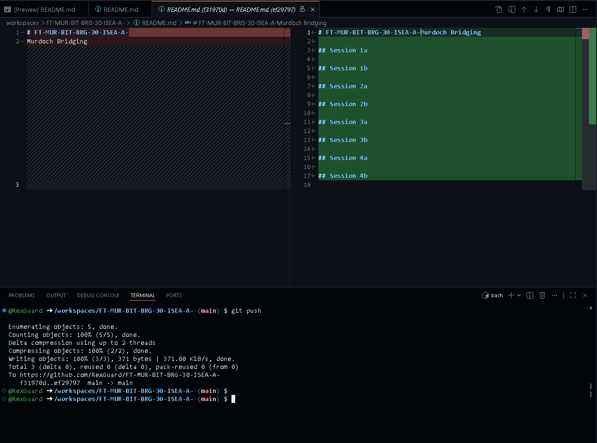

# FT-MUR-BIT-BRG-30-ISEA-A-Murdoch Bridging

## Session 1a

|||
|---|---|
|``git pull``| Pull Latest Version Of a File|
|``git stage <Filename>``|Select Specific file to update|
|``git commit -m <Message here>``|Saving in local repository history|
|``git push``|Make changes public|
## Session 1b

## Session 2a

## Session 2b

## Session 3a

## Session 3b

## Session 4a

## Session 4b
